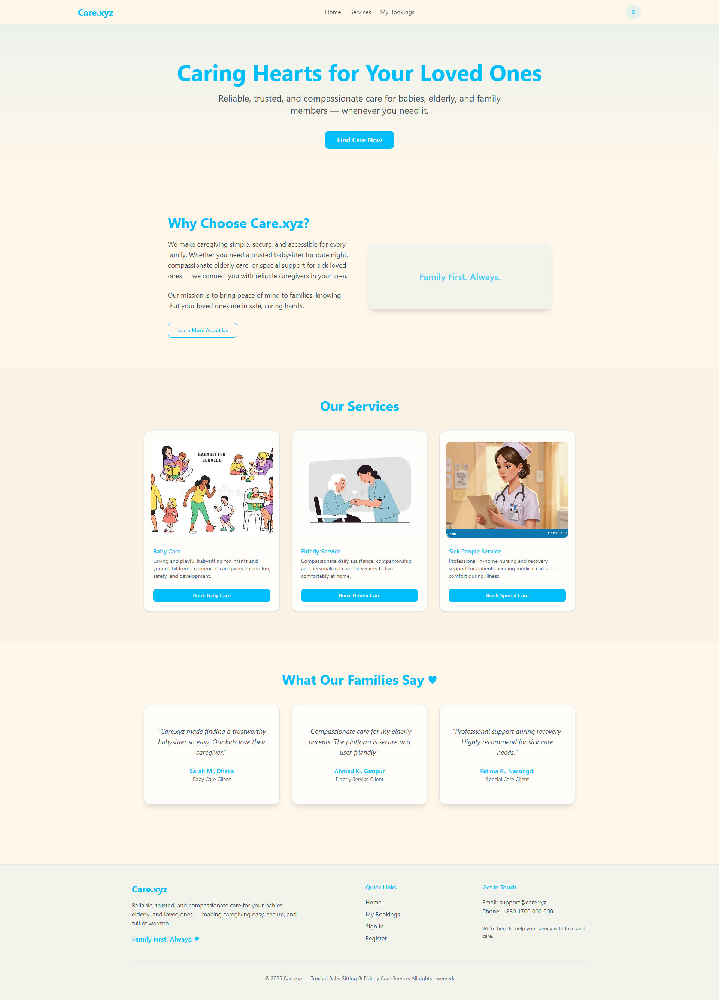
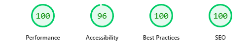

# Care.xyz – Baby Sitting & Elderly Care Service Platform ❤️

**A reliable and trusted platform** for booking verified caregivers for babies, elderly, and family members at home. Users can easily browse services, book by duration and location, track bookings, and receive email invoices — all with a soft, caring user experience.

🔥 **Live Demo**: [https://care-xyz-st.vercel.app](https://care-xyz-st.vercel.app)



### ✨ Key Features
- **Responsive Design** — Fully mobile, tablet, and desktop friendly with soft pastel colors and caring UI
- **User Authentication** — Email/Password + Google Social Login (via NextAuth)
- **Registration** — NID No, Name, Email, Contact, secure password validation
- **Dynamic Booking** — Select duration (hours/days), cascading location (Division → District → City → Area), address input, auto total cost calculation
- **Booking Flow** — Saved as Pending, email invoice sent instantly on confirmation
- **My Bookings Page** — Track all bookings (service, duration, location, cost, status), view details, cancel Pending bookings
- **Services** — Baby Care, Elderly Service, Special Care for Sick People with individual detail pages
- **Homepage** — Hero banner, About mission, Services overview, Trust metrics
- **Email Invoice** — Beautiful, caring confirmation email with full details (via Resend)
- **Smart UX** — Logged-in users book directly; guests redirected to login/register with callback URL
- **Custom Pages** — Thank-you after booking, 404 error page, footer on all pages
- **Metadata** — SEO-friendly titles/descriptions on Home & Service pages

### 🛠️ Tech Stack

| Technology       | Purpose                          |
|------------------|----------------------------------|
| Next.js 14 (App Router) | Full-stack framework             |
| MongoDB + Mongoose | Database & models (Users, Bookings) |
| NextAuth.js      | Authentication (Credentials + Google) |
| Tailwind CSS     | Responsive, soft styling         |
| shadcn/ui        | Beautiful, accessible components |
| Resend           | Email invoice delivery           |
| Vercel           | Deployment & hosting             |

### 🚀 How to Run Locally

1. Clone the repo
   ```
   git clone https://github.com/TheLunatic1/care-xyz.git
   cd care-xyz
   ```

2. Install dependencies
   ```
   npm install
   ```

3. Create `.env.local` file in root with these variables:
   ```
   MONGODB_URI=your_mongodb_connection_string
   NEXTAUTH_SECRET=your_random_secret (openssl rand -base64 32)
   NEXTAUTH_URL=http://localhost:3000
   GOOGLE_CLIENT_ID=your_google_client_id
   GOOGLE_CLIENT_SECRET=your_google_client_secret
   RESEND_API_KEY=your_resend_api_key
   ```

4. Run the development server
   ```
   npm run dev
   ```

5. Open [http://localhost:3000](http://localhost:3000)

Test login: `test@care.xyz` / `password123`

### 📱 Performance (Lighthouse)


- Desktop
- 
- Mobile
- 

(Optimized for 90+ scores in Performance, Accessibility, Best Practices & SEO)

### 🙏 Acknowledgements
- Icons & illustrations inspired by caring family themes
- Built with love for making caregiving easier and safer

Feel free to star ⭐ the repo if you find it helpful! Contributions welcome.

**Family First. Always. ♥**